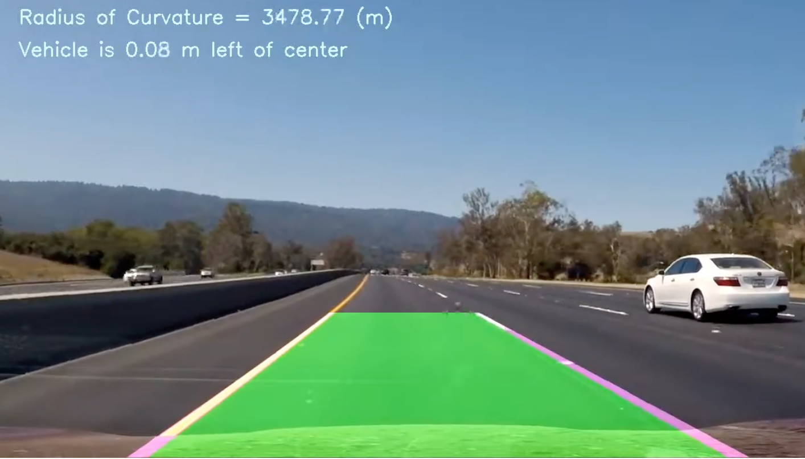

## Advanced Lane Finding

In this project, the goal is to write a software pipeline to identify the lane boundaries in a video.

### Project

The goals / steps of this project are the following:

* Compute the camera calibration matrix and distortion coefficients given a set of chessboard images.
* Apply a distortion correction to raw images.
* Use color transforms, gradients, etc., to create a thresholded binary image.
* Apply a perspective transform to rectify binary image ("birds-eye view").
* Detect lane pixels and fit to find the lane boundary.
* Determine the curvature of the lane and vehicle position with respect to center.
* Warp the detected lane boundaries back onto the original image.
* Output visual display of the lane boundaries and numerical estimation of lane curvature and vehicle position.

The images for camera calibration are stored in the folder called `camera_cal`.  The images in `test_images` are for testing the pipeline on single frames.  If you want to extract more test images from the videos, you can simply use an image writing method like `cv2.imwrite()`, i.e., you can read the video in frame by frame as usual, and for frames you want to save for later you can write to an image file.  

The output from each stage of the pipeline is saved in the folder called `output_images`, and a description is included in the writeup for the project of what each image shows.  The video called `project_video.mp4` is the video your pipeline should work well on.  

### Files 

[Jupyter Notebook](https://github.com/preeti-chauhan/SDCND-P4-Advanced-Lane-Finding/blob/master/P4.ipynb) The step by step development of project code.

[Project Report](https://github.com/preeti-chauhan/SDCND-P4-Advanced-Lane-Finding/blob/master/writeup_P4.pdf) The description of project steps.

### Results
Following is [this](https://www.youtube.com/watch?v=hkppnXiB2ak&feature=youtu.be) video output:

